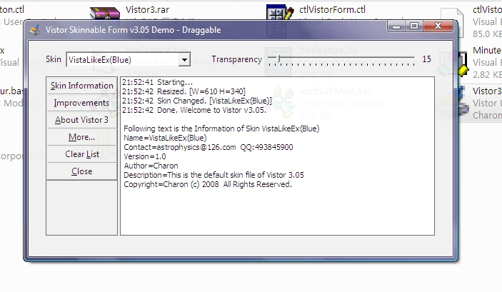



## An amazing Skinnable Form \- Vistor3

### Description

To customize your own skin onto your form, maximize the form, as well as set optional transparency.
 
### More Info
 

             |
---                |---
**Submitted On**   |2008-08-25 22:36:50
**By**             |[Charon'](https://github.com/Planet-Source-Code/PSCIndex/blob/master/ByAuthor/charon.md)
**Level**          |Intermediate
**User Rating**    |4.6 (32 globes from 7 users)
**Compatibility**  |VB 6\.0
**Category**       |[Custom Controls/ Forms/  Menus](https://github.com/Planet-Source-Code/PSCIndex/blob/master/ByCategory/custom-controls-forms-menus__1-4.md)
**World**          |[Visual Basic](https://github.com/Planet-Source-Code/PSCIndex/blob/master/ByWorld/visual-basic.md)
**Archive File**   |[An\_amazing2126629122008\.zip](https://github.com/Planet-Source-Code/charon-an-amazing-skinnable-form-vistor3__1-71077/archive/master.zip)

